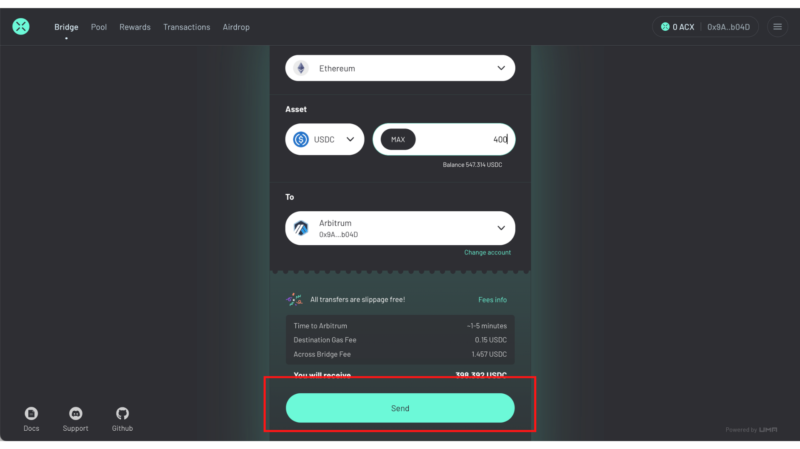
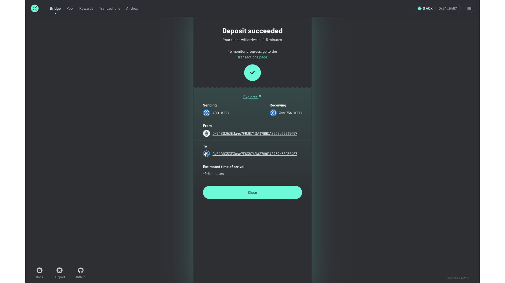

# Bridging

In this section, we walk you through how to perform a bridge transaction through the Across app.

### **Step 1: Enter bridge details**

For this step, you will choose the source [chain](https://app.gitbook.com/o/-MlBqw0sVAJZO0pl5jGc/s/o33kX1T6RRp4inOcEH1d/\~/changes/iP8dI29pg9c70nyzaFeV/how-across-works/supported-chains-and-tokens), the asset and amount, and the destination chain.&#x20;

Here is what each dropdown means on the Across Bridge page:

1. **From:** source chain
2. **Asset:** asset you want to transfer
3. **Size:** quantity of the asset you want to transfer
4. **To:** destination chain

<figure><figcaption></figcaption></figure>

Be sure to select the correct chain names from the _From_ dropdown and the _To_ dropdown. You should verify that your wallet is connected to the same network as the source chain.

### **Step 2: Approve contract**

The first time that you bridge a particular token from one chain, you'll need to approve the contract to transfer the token on your behalf. This step is not required if you are using ETH.

Click _Approve_ at the bottom of the page and confirm the transaction in your wallet.

<figure><figcaption></figcaption></figure>

### **Step 3: Bridge away**

The next step is to send the bridge.

At this point, you should verify that you have chosen the correct _From_ and _To_ chain and that you have input the amount of the token that you would like to send. Once you have verified this information, you can click the _Send_ button, and then confirm the transaction in your wallet.

<figure><figcaption></figcaption></figure>

### Step 4: Review

<figure><figcaption></figcaption></figure>

After the transaction has been confirmed in your wallet, you can review the details of the transaction on the confirmation page and monitor its progress on the [transaction page](https://app.gitbook.com/o/-MlBqw0sVAJZO0pl5jGc/s/o33kX1T6RRp4inOcEH1d/\~/changes/iP8dI29pg9c70nyzaFeV/how-to-use-across/transactions).&#x20;

