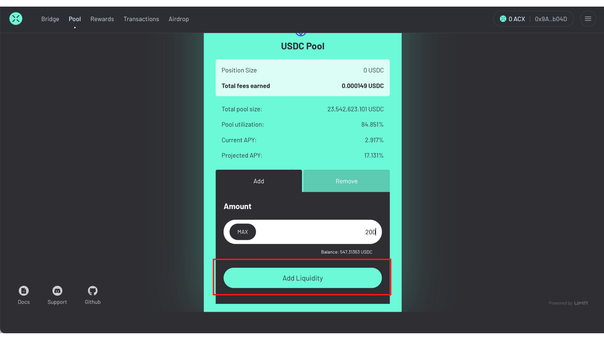
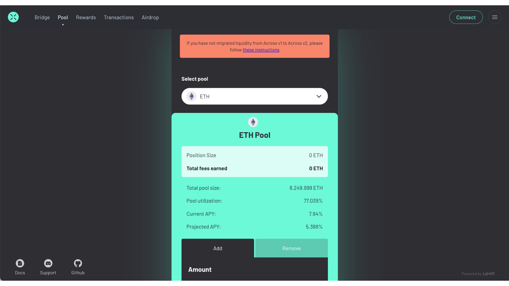

# Providing Liquidity

In this section, we describe how you can begin providing liquidity to Across. This is an important component of the Across ecosystem as this passive capital is used to quickly reimburse the active capital provided by the relayers.

When an individual provides liquidity to a pool, the individual receives an LP token which represents their individual share of the pool. This share becomes more valuable over time as it accrues fees generated from transfers.

The liquidity provider can withdraw their position at any time, provided there is enough liquidity in the pool. While the amount a liquidity provider withdraws from the pool will always be equal to or greater than what they put in, it's possible a liquidity provider may need to wait until tokens are transferred from non-Ethereum Mainnet chains into the unified liquidity pool on Ethereum Mainnet.

## Pool Tab Contents

Before we walk through how to provide liquidity using Across, let's first go through the data displayed in the _Pool_ tab on Across:

* **Position:** Your total deposits to the liquidity pool. Be sure to select the pool you provided liquidity to in the drop-down list if you are having issues seeing your deposit amount.
* **Fees earned:** Your portion of the liquidity fees earned from the pool. This value will continue to increase from fees the longer you have funds allocated to the pool.
* **Total Pool Size:** The total supply of all deposits in the pool.
* **Pool Utilization:** The percentage of the deposits in the liquidity pool currently being utilized.
* **Current APY:** APY currently accruing to LP tokens.
* **Projected APY:** Estimated liquidity fees earned annually on your deposit amount taking into consideration the pool utilization percentage.

## Adding Liquidity

### **Step 1: View the pool**

Go to [across.to/pool](https://across.to/pool) to view the pool.

<figure><figcaption></figcaption></figure>

### **Step 2: Select the asset pool to add liquidity to**

Select an asset to add to the pool by clicking the pool drop-down menu.

<figure><figcaption></figcaption></figure>

### **Step 3: Select an amount to add**

Set an amount of liquidity that you would like to provide to the Across pool selected.

<figure><figcaption></figcaption></figure>

### **Step 4: Add liquidity**

Click the _Add Liquidity_ button and confirm the transaction.

<figure><figcaption></figcaption></figure>

### **Step 5: Wait for confirmation**

Once the transaction has been processed on-chain, you will see a confirmation page.&#x20;

## Removing Liquidity

### **Step 1: View the pool**

You can view the pool by going to across.to/pool.

<figure><figcaption></figcaption></figure>

### **Step 2: Switch to the remove liquidity tab**

You will need to switch the tab from _Add_ to _Remove_ in order to remove liquidity.

<figure><figcaption></figcaption></figure>

### **Step 3: Select the asset pool to remove liquidity from**

Using the drop-down in the upper-middle of the screen, select the asset that you would like to remove liquidity for.

<figure><figcaption></figcaption></figure>

### **Step 4: Remove liquidity**

Select the amount that you would like to withdraw using the slider or click MAX to remove all of your liquidity.&#x20;

Note, if you have [staked](https://docs.across.to/how-to-use-across/rewards/reward-locking#how-to-stake-unstake-and-claim-staking-rewards) your LP tokens in the [Reward Locking](https://docs.across.to/how-to-use-across/rewards/reward-locking) program, you first need to [unstake](https://docs.across.to/how-to-use-across/rewards/reward-locking#unstaking) to be able to remove liquidity. &#x20;

Once you've chosen an amount to remove, click the _Remove liquidity_ button.

<figure><figcaption></figcaption></figure>

### **Step 5: Wait for confirmation**

Wait for the transaction to confirm. Once it has been confirmed, your liquidity is out of the pool and back into your wallet.
