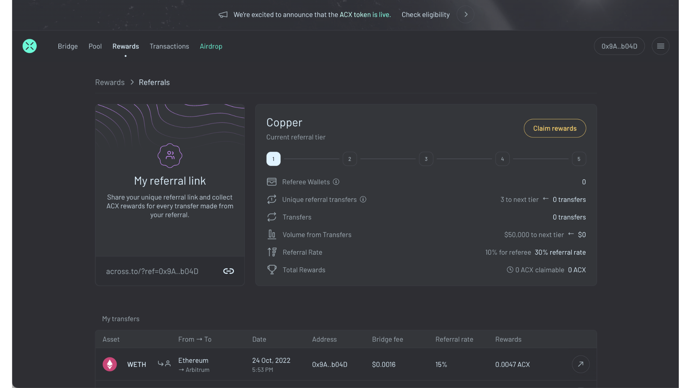

# Referral Rewards

## Program Details

#### Does the bridge user (i.e. the "referee") earn rewards?

Yes, referral rewards will be split between the referrer (75%) and the referee (25%).

#### Can a referrer refer themselves?

Yes. In this case, the referrer would earn 100% of the referral rewards.

#### How are referral rewards calculated per deposit?

The referral rewards earned by a referrer are proportional to the bridge fees [(explained more here)](https://docs.across.to/how-across-works/fees) paid by a user.  The formula is provided and explained below. Each referrer has a "referral tier" (based on their historical referred volume + number of unique wallets referred) which ranges from 40% to 80%.&#x20;

For example, Alex generates a referral link and sends it to Britt. Britt clicks on the link and does a bridge transfer of 10ETH that pays a 0.10% bridge fee. Alex is in the platinum referral tier which rewards 80% of the bridge fee. \
\
The referral reward from this bridge transfer is 0.008 ETH (10\*0.0010\*0.80). If ETHUSD is $1000 and ACXUSD is $0.20 then the reward denominated in ACX is 80 ACX (0.008 \* 1000 / 0.20).\
\
Referral rewards are split between referrer and referee 75%/25% respectively. So in this example, Alex earns 60 ACX (80\*0.75) and Britt earns 20 ACX (80\*0.25)

$$
x = depositAmount
$$

$$
r = referralTier
$$

$$
fee = min(0.12, bridgeFee)
$$

$$
usd = tokenUSDExchangeRate
$$

$$
acx = 1/ACXUSDExchangeRate
$$

$$
B = rewardBoost
$$

$$
referralReward=B*x*r*fee*usd*acx
$$

(Note that the highest bridge fee in the reward calculation is 0.12% of the deposit amount.)

#### When did Across start referral rewards?

For bridge transfers before July 11, 2022: Any address that has submitted at least one transaction on Ethereum Mainnet can receive referral rewards. This transaction does not have to be Across-related. The technical check here is that the [account has a nonce](https://help.myetherwallet.com/en/articles/5461509-what-is-a-nonce) greater than 0.

After July 11, 2022: Any address can receive referral rewards regardless of its nonce.

The different logic before and after the seemingly arbitrary July 11, 2022 date is necessary because the referral tagging logic changed after that day and we needed a way to distinguish addresses from random strings of bytes before it. For those who can read code and are curious, [this code commit to the frontend](https://github.com/across-protocol/frontend-v2/commit/93644eff4a3efcb222b952ed9218b105253776a8) made it far easier to identify eligible referrer accounts and thereafter it is no longer necessary to check a wallet's nonce.

#### How do referral reward tiers work?

Reward tiers award 40 to 80% of the user's transfer fees, to be denominated in ACX. The tiers are based on historical referrer volume and/or the number of unique referral transfers. In the following descriptions, a "unique referral transfer" refers to a bridge transfer that was sent and included a referral tag from a unique wallet. For example, 20 transfers with the same sender wallet count only as 1 "unique referral transfer".

1. **Copper**: 40% referral fee. Every referrer starts here.
2. **Bronze**: 50% referral fee. Copper referrers progress to Bronze after 3 unique referral transfers or > $50k in bridge volume.
3. **Silver**: 60% referral fee. Bronze referrers progress to Silver after 5 unique referral transfers or > $100k in bridge volume.
4. **Gold**: 70% referral fee. Silver referrers progress to Gold after 10 unique referral transfers or > $250k in bridge volume.
5. **Platinum**: 80% referral fee. Gold referrers progress to Platinum after 20 unique referral transfers or > $500k in bridge volume.

#### How do referrers receive ACX?

Referral rewards will be claimable periodically (not continuously) via a claim dApp. Users will always be able to view their pending claimable rewards but the rewards will usually not be claimable right away. Rewards will be distributed in batches and the frequency of these batches is still to be determined. Note that the first set of rewards will not be claimable until the token exists.

For those curious, referral rewards will be distributed via [this MerkleDistributor contract](https://github.com/UMAprotocol/protocol/blob/ea52fb022fb8e8b345a8e965a406bd3461cd5e8f/packages/core/contracts/merkle-distributor/implementation/MerkleDistributor.sol) which has been audited by OpenZeppelin and Paladin. The OZ audit report can be found [here](https://blog.openzeppelin.com/uma-continuous-audit/) and the specific section on this contract can be found by searching for "MerkleDistributor". The Paladin report can be found [here](https://paladinsec.co/projects/covenant/).

#### Does my referee need to click my referral link each time for me to reap the rewards?

No. Unless your referee clicks on another referral link, they will be linked to you for all of their transfers. The referral links are "sticky."

#### Does my referral reward tier change after I claim rewards?

Yes. If you claim your rewards, you will forfeit your referral tier status _and_ existing referrer addresses will no longer accrue to you. Your volume and number of referrals reset back to 0. You start from the beginning again at the **Copper** tier. &#x20;

#### How do we know whether a bridged transfer originated via a custom referral URL?

This section explains how bridged transfers are ultimately associated with referrer addresses.&#x20;

Do we store all such transfers in a database? The answer is that referrer data is appended to the end of bridged transaction [calldata](https://docs.soliditylang.org/en/v0.8.13/internals/layout\_in\_calldata.html).&#x20;

Specifically, the referrer address should follow a special 8 byte delimiter: "0xd00dfeeddeadbeef". Here's [example React.js code](https://github.com/across-protocol/frontend-v2/blob/93644eff4a3efcb222b952ed9218b105253776a8/src/utils/format.ts#L104) that implements this tagging.

This is an example transaction for a deposit from Arbitrum: [https://arbiscan.io/tx/0x1f4c7c0dc54171ebb965cba21ce7deffa6298edc2e9503a8e411e146ffef5876](https://arbiscan.io/tx/0x1f4c7c0dc54171ebb965cba21ce7deffa6298edc2e9503a8e411e146ffef5876) . If you click on the transaction page and go to the "Input Data" field, we can see the "calldata". The last 28 bytes are highlighted and is (1) 8 byte delimiter + (2) the referrer's address (1 byte equals 2 characters, so "9a" is 1 byte). To be clear, in this example the referrer address is "0x9a8f92a830a5cb89a3816e3d267cb7791c16b04d".

Users who navigate to [across.to](https://across.to/) via a referral URL will automatically have their transactions tagged by this [piece of code ](https://github.com/across-protocol/frontend-v2/blob/93644eff4a3efcb222b952ed9218b105253776a8/src/utils/format.ts#L104)in the [React](https://www.w3schools.com/whatis/whatis\_react.asp) dApp. This dApp enables users to call the Across contracts directly bridge transfers, but it's also possible to call the Across contracts via another contract. This is how [Socket, a bridge aggregator](https://docs.socket.tech/socket-api/contracts), routes bridge transactions to Across.

Referrer tags can be included in any smart contract transaction that ultimately bridges via Across as long as the resultant transaction calldata includes the referrer tag.

## **How to Earn Referral Rewards**

### **Step 1: On the** [**Rewards**](https://across.to/rewards) **dashboard, under the Referrals section, click **_**View All Data**_&#x20;

<figure><figcaption></figcaption></figure>

The Referral rewards page displays additional information of your referral activity, including rewards earned, tier status and allows you to claim referral rewards.&#x20;

**Important Note: Referrers rise in tier as long as they don't claim their rewards. Once rewards are claimed they are reset and all referral links are broken.**

<figure><figcaption></figcaption></figure>

### **Step 2: Share your link and start earning!**

Share your new referral link with friends and on social media.&#x20;

You can also generate your referral link manually by following these steps:

1. Decide at which address you want to receive ACX referral rewards.
2. Direct users to Across with a "referrer" request parameter like so: [https://across.to/?referrer={address}](https://across.to/?referrer=0x9a8f92a830a5cb89a3816e3d267cb7791c16b04d).

Anyone who completes bridge transfers using your custom referral URL will increase the amount of ACX referral rewards to be claimable by your wallet and they will also earn some rewards themselves. Rewards are split 75%/25% between the referrer and referee respectively.

Visit the rewards page often and check out ‘My transfers’ at the bottom of the page to see what you’ve earned so far.

<figure><figcaption></figcaption></figure>

### Step 3: Create strategies to build your referral network and join the Referral Rangers on our offical Discord to trade tips and tricks with fellow referrers.

Please note: Once someone completes a bridge transaction with your link, it will stay attached for all other transactions, unless they click someone else's link or you claim your referral rewards.&#x20;

You can learn more about the referral program by going to our [detailed explainer](https://docs.across.to/how-to-use-across/rewards/referral-rewards) on this docs site or reading our [launch article on Medium](https://medium.com/across-protocol/across-referral-program-is-now-live-how-you-can-farm-acx-tokens-today-695019797820).&#x20;

<figure><figcaption></figcaption></figure>
