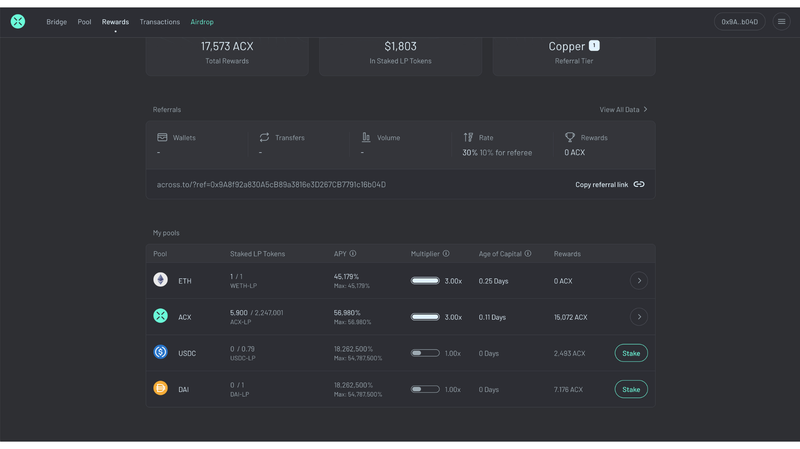
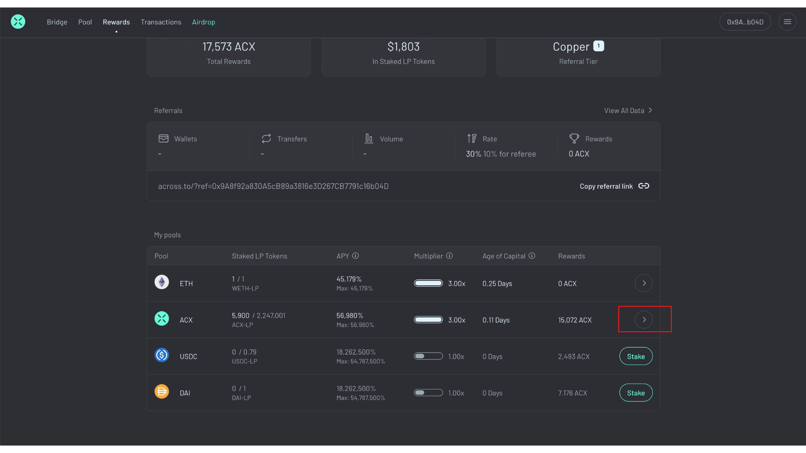
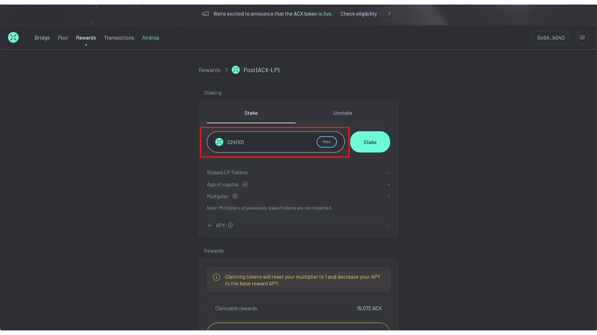
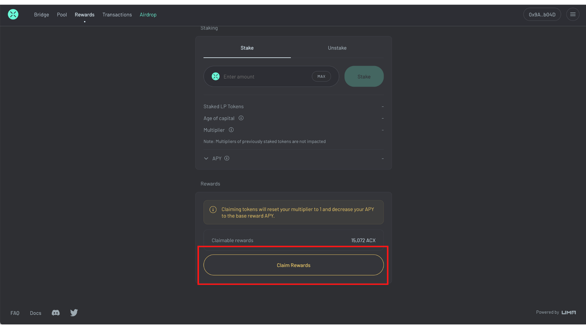

# Reward Locking

## **Program Details**

### Overview

Across is the first protocol to implement reward locking. It will be used to incentivize LPs to pool ETH, USDC, DAI, WBTC and ACX to facilitate bridge transfers. Each incentivized liquidity pool will have a base rate of emission and each LP will have a unique multiplier for each of these pools. The LP will earn a pro-rata share of the base rate emission multiplied by the LP’s unique multiplier. For Across’ reward locking programming, an LP’s multiplier starts at 1 on day zero and can grow linearly to a maximum of 3 when rewards are left unclaimed for 100 days.&#x20;

<figure><figcaption></figcaption></figure>

<figure><figcaption>
As an example, an LP that has held rewards unclaimed for 60 days will have a 2.2 multiplier. Once an LP claims ANY rewards, the multiplier immediately resets to 1 and the LP would need to earn that multiplier again.
</figcaption></figure>

Across will commit 75,000,000 $ACX for the initial reward locking program. It is expected to operate for at least 6 months and will be reviewed at that point for any changes.

### **Benefits of Reward Locking** 

Keeping rewards locked discourages farm and dump activity, but more importantly makes the LP and referrer more engaged with the protocol. If you are encouraged to have a stake in the protocol you will naturally want to know more about it and are incentivized to join the community and further its mission.

> **Reward Locking = Gamification of DeFi**

In addition to the economic benefits, the multiplier and the status symbol of it offers the user intangible value. Given the various unique multipliers you can earn for each liquidity pool and the different tiers you can acquire as a referrer, each wallet that contributes to the protocol will develop a personalized identity. Similar to a character in a role-playing game, the various stats can be translated into experience points that could allow the wallet to level up and obtain status in the protocol.

Reward locking can be gamified further with a well-thought-out user interface and user experience to make it appear like an actual game. You can read more details in this [article](https://medium.com/across-protocol/introducing-reward-locking-78b26c792b11).

### **Reward Locking for the $ACX Airdrop** 

$ACX airdrop recipients have the opportunity to experience the benefits of reward locking when they claim. **$ACX will be rewarded as an $ACX Across LP token and automatically staked into a reward locking contract** that will be paying a generous return. The pooled and staked $ACX will allow $ACX to be efficiently bridged to all Across destinations. Airdrop recipients who are staked will immediately start earning more $ACX and can watch their multipliers and returns increase.

### Adding Additional Liquidity to Stake in Reward Locking.&#x20;

When you add additional tokens to your already existing staked assets, you may wonder how the average age of capital is calculated. Our formula uses the time-weighted sum of deposits.&#x20;

For example, if you deposit 10 tokens at time 1, the average age of capital is 1. If you deposit the next 5 tokens at time 5, the average age of capital = (1 \* (10/15) + 5 \* (5/15)) = 2.3333

### **Information for Other Projects Looking To Implement Reward Locking**

Risk Labs (the foundation that supports UMA and Across Protocol) has already deployed a contract called the [Accelerating Distributor](https://github.com/across-protocol/across-token/blob/master/contracts/AcceleratingDistributor.sol) ([audit](https://blog.openzeppelin.com/across-token-and-token-distributor-audit/)) to allow any project to implement the concept of reward locking. You can read the full details in our [Reward Locking article](https://medium.com/across-protocol/introducing-reward-locking-78b26c792b11).&#x20;

## How to Stake, Unstake and Claim Staking Rewards

### **Step 1: On the** [**Rewards**](https://across.to/rewards) **dashboard, scroll to the **_**My pools**_** and **_**All pools**_** sections**

<figure><figcaption></figcaption></figure>

The **My pools** table includes incentivized pools that you have provided liquidity to, allowing you to stake, unstake or edit your staked position.&#x20;

The **All pools** table includes incentivized pools that you have have **not** provided liquidity to, allowing you to add liquidity and then stake your resulting LP tokens to earn additional ACX.&#x20;

* **Pool:** asset pool on Across
* **Staked LP tokens:** number of LP tokens you have staked, compared to how many are in your wallet.
* **APY:** Your individual total APY for the pool, including the pool APY plus rewards APY times your multiplier. Max APY is the maximum APY if you were to stake your LP tokens for 100 days for a multiplier of 3x.&#x20;
* **Multiplier:** Your individual [reward locking](https://docs.across.to/how-to-use-across/rewards/reward-locking) multiplier applied to the pool's base reward APY, based on your age of capital.
* **Age of capital:** Number of days you've staked LP tokens without claiming rewards. Weighted by size if multiple positions have been staked. Your multiplier increases linearly from 1x to 3x, maxing at 3x once your age of capital exceeds 100 days.&#x20;
* **Rewards:** Earned ACX you've earned from your staked positions.

### Step 2: Click the arrow or _Stake_ button&#x20;

<figure><figcaption></figcaption></figure>

### Step 3: On the _Stake_ tab, enter the amount to stake and click _Stake_

<figure><figcaption></figcaption></figure>

After inputting an amount to stake, your Staked LP tokens, age of capital, multiplier will update and show your estimated APY based on the staked position entered.&#x20;

### Step 4: Sign and Confirm

You will be asked to sign the transaction and will be given a confirmation message. Your staked position will appear in the My Pools section on the [Rewards](https://across.to/rewards) dashboard.

Your tokens are now staked in the reward locking contract. For detailed information on our Reward Locking Program, [click here](https://docs.across.to/how-to-use-across/rewards/reward-locking).&#x20;

### Unstaking

To _Unstake_ select the Unstake tab and follow the same steps above. Unstaking only unstakes your staked LP tokens from the Reward Locking contract. It does not remove tokens from the liquidity pool. If you want full access to your currently staked tokens you must Unstake and then [Remove Liquidity](https://docs.across.to/how-to-use-across/providing-liquidity#removing-liquidity).

### Claim Staking Rewards

**Please note: Claiming your staking rewards will set your multiplier back to 1 and decrease your APY.**&#x20;

You can claim staking rewards by navigating to the _Stake_ or _Unstake_ tabs for a given pool. After executing the transaction, the ACX amount claimed will be sent to your wallet.&#x20;

<figure><figcaption>
 
</figcaption></figure>
